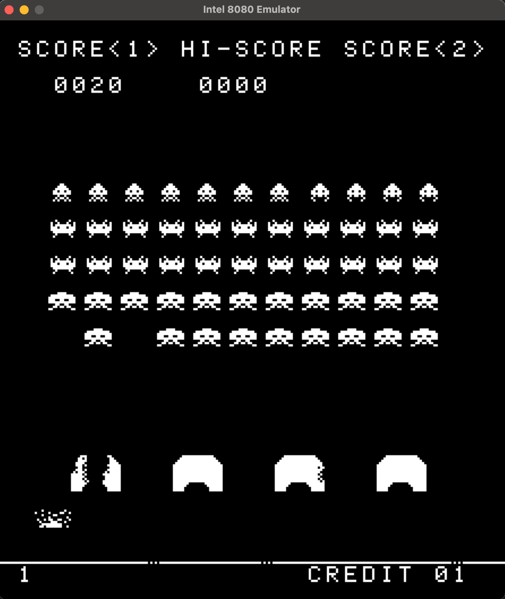
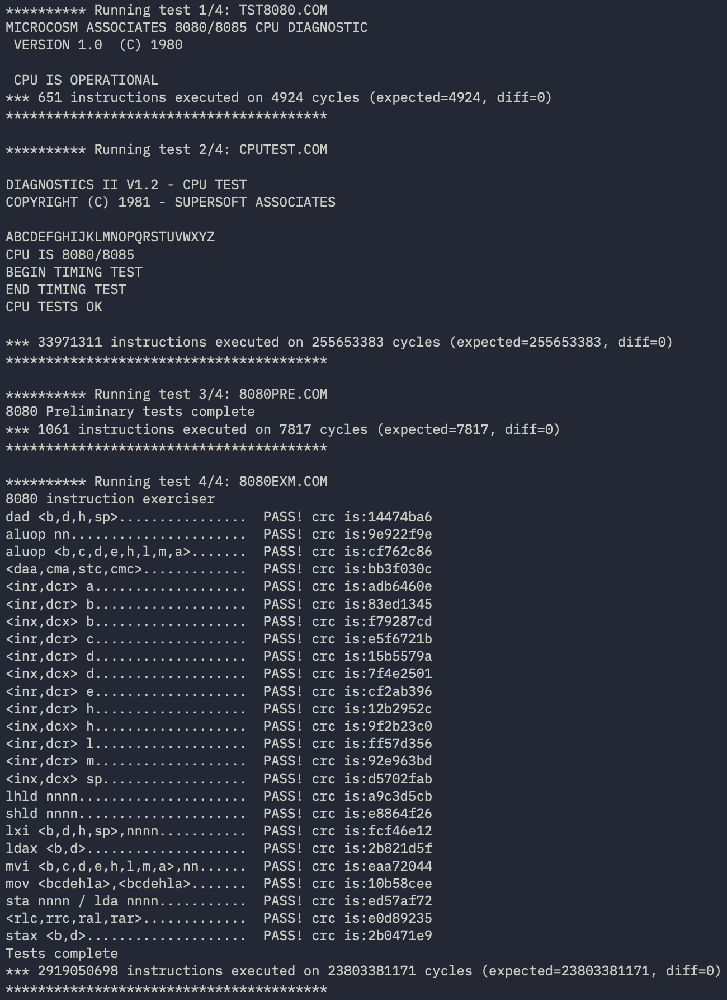

# Intel 8080 Emulator (Space Invaders)

A cycle-accurate Intel 8080 CPU emulator written in C++20, targeting Space
Invaders as the primary test ROM, with SDL2 for video and input.



## Features

- Full 8080 instruction set via a function-pointer dispatch table (`OPCODE_TABLE`)
- Real flag computation (Zero, Sign, Parity, Carry, Aux Carry) with hardware-accurate
  half-carry/borrow logic for ALU ops
- Interrupt support (`RST` vector servicing, enable/disable, halt)
- Space Invaders hardware: VRAM rendering, bit-shift register I/O (ports 2/3/4),
  keyboard-mapped input ports
- CP/M BDOS intercept mode for running the standard 8080 CPU test suite
  (`TST8080`, `CPUTEST`, `8080PRE`, `8080EXM`)

## Build

Requires CMake ≥ 3.15 and a C++20 compiler. SDL2 is fetched automatically via
`FetchContent`.

```bash
mkdir build && cd build
cmake ..
cmake --build .
```

Place Space Invaders ROM files (`invaders.h`, `.g`, `.f`, `.e`) in `roms/` at
the project root before running.

```bash
./intel-8080-emulator-cpp
```

## Controls

| Key       | Action           |
|-----------|------------------|
| C         | Insert coin      |
| Enter     | Player 1 start   |
| Space     | Fire             |
| Left/Right| Move             |
| Esc       | Quit             |

## Architecture

```
Emulator          owns Bus, Intel8080, Display; runs the 60Hz frame loop
├── Bus           64KB memory + 256 I/O ports; Space Invaders shift register
│   └── Memory    raw byte array read/write
├── Intel8080     registers, flags, interrupt state, step()/dispatch
│   └── OPCODE_TABLE   256-entry table of { mnemonic, cycles, handler }
└── Display       SDL2 window/renderer, VRAM → texture, keyboard → ports
```

CPU logic is split across:
- `Intel8080.cpp` - core fetch/decode/dispatch loop, register decode helper
- `Opcodes_ALU.cpp` - arithmetic/logic instructions and flag helpers
- `Opcodes_Move.cpp` - data movement, stack, register pair ops
- `Opcodes_System.cpp` - jumps, calls, returns, RST, interrupts, I/O

Each opcode handler is a single member function driven by bitfields decoded
from the raw opcode byte at runtime (e.g. `op_MOV`, `op_AluReg`), rather than
one function per opcode.

## Port I/O

`Bus` dispatches `IN`/`OUT` through per-port handler tables (`std::function`,
indexed by port number) instead of a hardcoded switch. `setupPortHandlers()`
wires up the Space Invaders shift-register hardware:

- `OUT 2` - sets the shift offset
- `OUT 4` - shifts a new byte into the 16-bit shift register
- `IN 3`  - reads the shift register at the current offset

Ports with no registered handler fall through to the raw `ports[]` array -
this is how plain input ports (1, 2 for buttons/DIP switches) work, since
`Display::handleInput` writes directly into that array.

External code can register or override a port at runtime via
`Bus::setOutHandler` / `Bus::setInHandler`, without `Bus` needing to know
who's calling. The CPU test harness (see below) uses this to hook ports 0
and 1 for its own purposes, without touching `Bus` at all.

## CPU test mode

Build with `CONFIG_RUN_TEST_MODE` defined to run the classic 8080 diagnostic
ROMs (`TST8080.COM`, `CPUTEST.COM`, `8080PRE.COM`, `8080EXM.COM`) instead of
booting the Space Invaders hardware.

The harness injects real instructions at the two addresses CP/M test ROMs
call into, rather than intercepting on `PC`:

- `0x0000`: `OUT 0,A` - the ROM's own exit signal
- `0x0005`: `OUT 1,A` then `RET` - stands in for a BDOS call

`Bus::setOutHandler` hooks port 0 to set a `testFinished` flag, and port 1
to print based on whatever the ROM left in registers C/D/E (function 2 =
print character, function 9 = print `$`-terminated string)
Because these are real instructions, `cpu.step()` charges their actual cost from `OPCODE_TABLE`, so the main loop
is just:

```cpp
while (!testFinished)
{
    cycles_n += cpu.step();
}
```
Cycle counts are printed against known-good expected values for each ROM at the end of each run.



## Status / known gaps

- Memory access is routed through `Bus`, but a full `Bus` abstraction
  (for supporting machines beyond Space Invaders) is not yet in place.

## Roadmap

- [ ] Additional ROM target support
